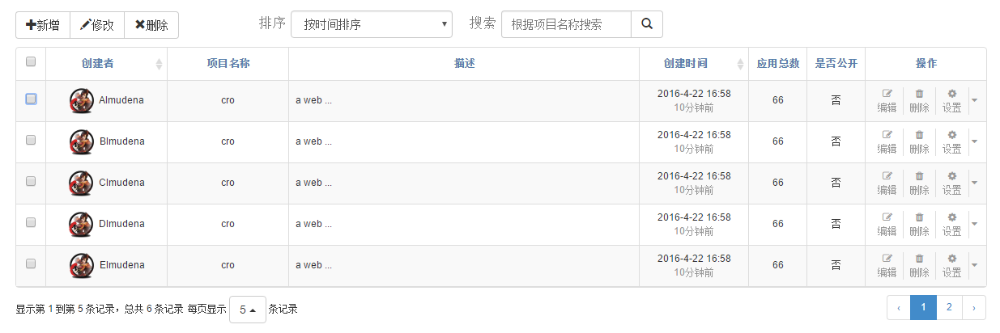

因为项目需要,所以需要将bootstrap table作为引入到我们的系统中来,作为bootstrap table使用的新手,刚开始不知所措.为了能够帮助别人所以特此写出这个笔记,供大家参考.
http://bootstrap-table.wenzhixin.net.cn/ 这个是bootstrap table 的官网,作者将源码托管在github上,有兴趣的可以将源码下载下来多多研究下!

开始之前先贴上自己目前做出的效果

刚刚开始的时候,你一定不知道如何使用bootstrap table,那么记得一定要看**Getting started**,看了之后,你就知道如何将bootstrap table用在自己的系统中!

接着就是看他的帮助文档了,不得不说这个帮助文档很好,自己需要哪个属性直接配置就好了,这里有一个小的技巧,因为帮助文档是在表格中,有时候文在在表格中放不下,就会出现横向滚动条,看起来特别的不方便,有一个快捷键就是按住shift键,然后滚动鼠标滚轮就可以横向滚动了.下面我来介绍几个不太好理解的属性,也是我在使用过程中费了大量时间才尝试出来的!哦,还有一点,一定要看英文的,中文的有时候没有示例,反而不如英文的.

 1. icons 
这个属性是为了修改按钮的小图标,因为表格中可以显示出刷新,切换等按钮,如果你不喜欢它原来的按钮,就可以直接将其修改为你喜欢的,我在使用的过程中换过图标,我就直接使用bootstrap
提供的图标,没有出现什么问题,至于其他的图标,没有尝试,读者可以自己尝试.修改的时候,直接将示例全部复制过去,如果你只是在其中写了你想修改的,而没有写那些不需要修改的,就会出现图标的缺失.
 2. toolbar 
这个属性非常有作用,有时候你想在表格的上面添加一些自己的按钮,例如添加,修改,删除之类的,结果你发现帮助文档中没有提到,应该如何添加按钮,这时候我们就需要使用到这个属性.
首先你可以配置toolbar: '#toolbar'这个代表的意思就是 只要你在html中写了 id为toolbar的标签,其中的内容就会显示到表格的头部,这个就可以实现我们实际的需求
```HTML
 <table id="toolbar" border="0px">
	<tr height="34px">
		<td width="300px" align="left">
			<div class="btn-group">
			   <button id="btn_add" type="button" class="btn btn-default"><span class="glyphicon glyphicon-plus" aria-hidden="true"></span>新增</button>
			   <button id="btn_edit" type="button" class="btn btn-default"><span class="glyphicon glyphicon-pencil" aria-hidden="true"></span>修改</button>
			   <button id="btn_delete" type="button" class="btn btn-default"><span class="glyphicon glyphicon-remove" aria-hidden="true"></span>删除</button>
			</div>
		</td>
		<td width="40px" align="left" >
			<span style="font-size:17.08px; color:#7B7B7B">排序</span>
		</td>
  		<td width="200px">
			<select class="form-control"> 
			     <option>按时间排序</option> 
			     <option>按创建者排序</option>
		    </select>
	    </td>
	    <td width="20px"></td>
	    <td width="40px" align="left">
	    	<span style="font-size:17.08px;color:#7B7B7B"">搜索</span>
	    </td>
		<td width="200px">
			<div class="input-group">
	    		<input type="text" class="form-control" placeholder="根据项目名称搜索">
	     		<span class="input-group-btn">
	       			<button class="btn btn-default" type="button"><span class="glyphicon glyphicon-search" aria-hidden="true"></span></button>
	    		</span>
	  		</div>
		</td>
 	 </tr>
 </table>
```
上面就是笔者自己的一个使用实例,希望能够帮助大家.
 3. checkbox
Column options 里面的 checkbox 可以让你在表格中显示出checkbox,这个是表格中经常用到的功能,同时checkboxHeader属性默认就是true,从而会在头部出现一个checkbox
可以实现对下面checkbox的全选操作,至于具体细节大家可以自己尝试,但是我在使用过程中遇到的问题就是,当一个一行放不下的时候,我在一行中有换行,但是给checkbox设置了垂直居中没有作用,这时候就难为到我了,checkbox居然不能够垂直居中,最后我的解决思路是通过事件修改checkbox的样式
```javascript
onAll:function(name, args){
			$("td").css("vertical-align","middle");
}
```
这样就可以实现checkbox的垂直居中了.
未完待续...